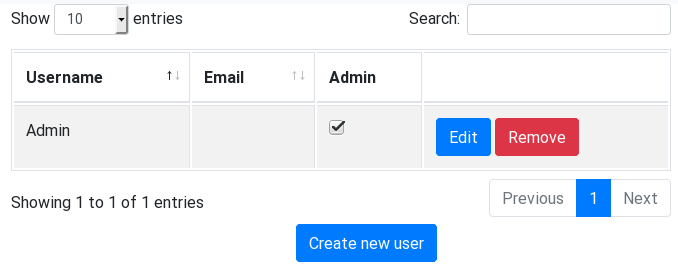
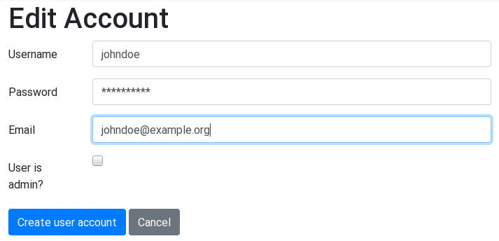
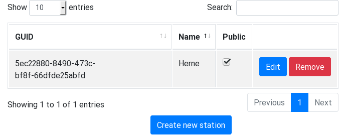
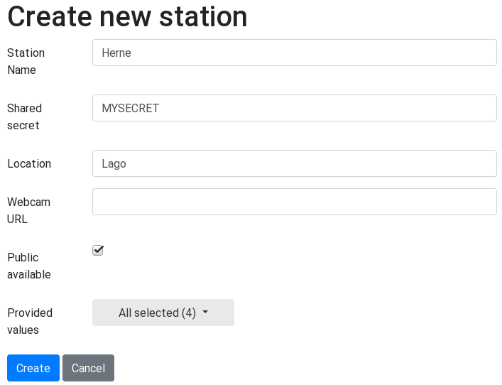
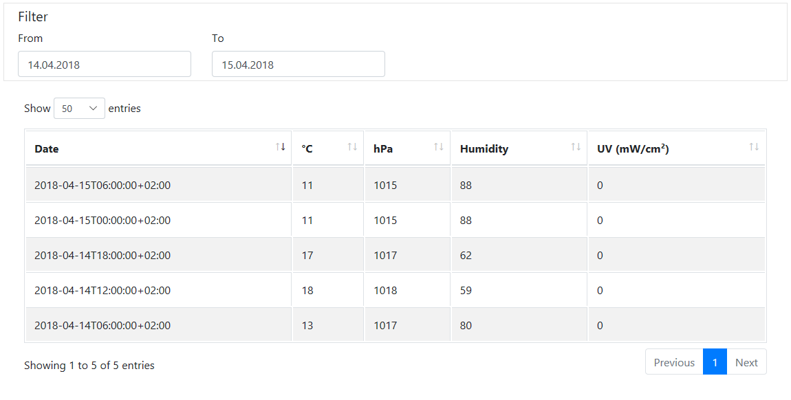
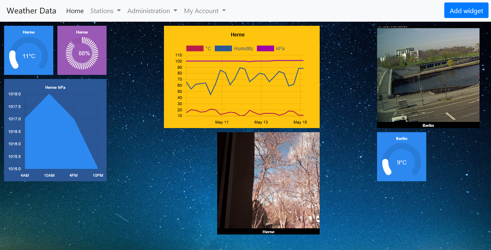
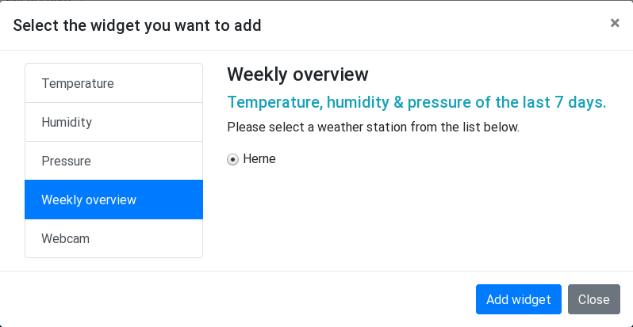
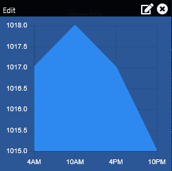

# WeatherService - README

**WeatherService** lets you collect, share and organize measurements of
weather stations. A station can be public available or only for registered
users.

## Setup

### Checkout source code

Check out the source code with the following command:

```
$ git clone https://github.com/20centaurifux/WeatherService
```

### Install dependencies

The solution is based on .NET Core 2. To install dependencies go to the
checked out "WeatherService" directory and run these commands:

```
$ dotnet restore
$ cd WeatherStation
$ bower install
```

### Setup database

**WeatherService** uses [LINQ to DB](https://github.com/linq2db/linq2db) for database access. You find scripts for
Firebird and SQLite in the [SQL](https://github.com/20centaurifux/WeatherService/tree/master/SQL) subfolder.

Creating a SQLite database is simple:

```
$ sqlite3 database/WeatherService.db < SQL/sqlite.sql
```

After setting up the database define the connection string and database provider
in the [configuration file](https://github.com/20centaurifux/WeatherService/blob/master/WeatherService/configuration/WeatherService.ini).

### Create administrator account

Now it's time to start the web application:

```
$ dotnet run
```

Visit the following website to create the administrator account:

```
http://localhost:5000/Setup
```

Login and change the password under "My Account" -> "My Profile".

# Quick Guide

## Administration

### User Accounts

Go to "Administration" -> "User Accounts" to manage users. The following screen displays a list of registered user accounts.



Click the "Edit" or "Remove" button to change or delete a user profile. A new user account can be created with the "Create new user" button below the table.



Users must have a unique login name and password. Additionally, you can set an optional mail address.

By setting the "admin" flag an account is allowed to access the user and weather station management screens.

### Weather Stations
Go to "Administration" -> "Weather Stations" to organize weather stations. The following screen displays a list of existing stations. Each one has an automatic generated GUID.

Click the "Edit" or "Remove" button to change or delete a weather station. A new station  can be registered with the "Create new station" button below the table.



Station names have to be unique. The shared secret is required if you want to upload measurements with the REST API.

At the current stage a station can provide Temperature (°C), Pressure (hPa), absolute Humidity (percent), UV (mW/cm²) and a webcam link.

By setting the "public" flag a station is accessible anonymously.



## Measurements

### Log Values

To display measurements select a station from the "Stations" list.



### Dashboard

Users have their own customizable dashboard. It's possible to add widgets and move them by drag & drop.



The "Add widget" button opens a dialog where you can chose a widget that you want to show on your dashboard.



Move the mouse cursor over a widget if you want to delete it or change the data source.



# REST Interface

To send your measurements post a JSON array to */api/WeaterLog/{guid}*. The example below describes the format:

```
[{ timestamp: 1523899859, // UNIX timestamp (UTC)
   temperature: 23.5,
   pressure: 998,
   humidity: 55,
   uv: 0.31
 }]
```

## Authentication

The client has to send the following HTTP headers for authentication:

* **X-WeatherStation-SenderId** GUID of the station
* **X-WeatherStation-Timestamp** current UNIX timestamp (UTC)
* **X-WeatherStation-HMAC** lower case hexadecimal checksum of the timestamp

The timestamp is hashed with HMAC-SHA1:

```  
HMAC_SHA1($timestamp, $secret)
```

You find an example in the [authentication middleware](https://github.com/20centaurifux/WeatherService/blob/master/WeatherService/Security/ApiAuthentication/Middleware.cs#L89).
